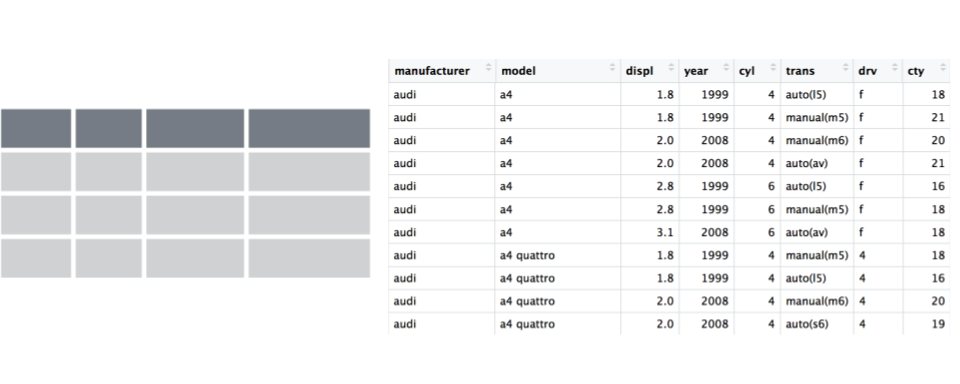

# Data Wrangling: `dplyr` {#dplyr} 

```{r wrangling1, include=FALSE}
knitr::opts_chunk$set(echo = TRUE)
library(htmltools)
```

> Data scientists, according to interviews and expert estimates, spend from 50 percent to 80 percent of their time mired in the mundane labor of collecting and preparing data, before it can be explored for useful information. - [NYTimes (2014)](http://www.nytimes.com/2014/08/18/technology/for-big-data-scientists-hurdle-to-insights-is-janitor-work.html)


## Overview of `dplyr` 

We are going to introduce you to data wrangling in R first with the tidyverse. The tidyverse is a new suite of packages that match a philosophy of data science developed by Hadley Wickham and the RStudio team. I find it to be a more straight-forward way to learn R. We will also show you by comparison what code will look like in "Base R", which means, in R without any additional packages (like the "tidyverse" package)  installed. I like David Robinson's blog post on the topic of [teaching the tidyverse first](http://varianceexplained.org/r/teach-hard-way).

For some things, base-R is more straight forward, and we'll show you that too. Whenever we use a function that is from the tidyverse, we will prefix it so you'll know for sure. 

**Objectives**

- learn about tidy data
- learn `dplyr` with `gapminder` data
- practice RStudio-GitHub workflow

**Resources**

Today's materials are again borrowing from some excellent sources, including:

- Jenny Bryan's lectures from STAT545 at UBC: [Introduction to dplyr](http://stat545.com/block009_dplyr-intro.html)
- Hadley Wickham and Garrett Grolemund's [R for Data Science](http://r4ds.had.co.nz/)
- Software Carpentry's R for reproducible scientific analysis materials: [Dataframe manipulation with dplyr](http://swcarpentry.github.io/r-novice-gapminder/13-dplyr.html)
- First developed for [Software Carpentry at UCSB](http://remi-daigle.github.io/2016-04-15-UCSB/dplyr/)
- [RStudio's data wrangling cheatsheet](http://www.rstudio.com/wp-content/uploads/2015/02/data-wrangling-cheatsheet.pdf) 
- [RStudio's data wrangling webinar](https://www.rstudio.com/resources/webinars/data-wrangling-with-r-and-rstudio/) 

## Prerequisites 

**R Skill Level**: Beginner - you've got basics of R down and are ready to wrangle your data.

We will use the `dplyr` package, which will have been installed with:

```r
install.packages('tidyverse')
```

## Tidy Data

Hadley Wickham, RStudio's Chief Scientist, has been building R packages for data wrangling and visualization based on the idea of **tidy data**. 

Tidy data has a simple convention: put variables in the columns and observations in the rows.


</br>
</br>
The `mpg` dataset we were working with this morning was an example of tidy data. When data are tidy, you are set up to work with it for your analyses, plots, etc. 
</br>
</br>
 

Right now we are going to use `dplyr` to wrangle this tidyish data set (the transform part of the cycle), and then come back to tidying messy data using `tidyr` once we've had some fun wrangling. These are both part of the `tidyverse` package that we've already installed:


And actually, Hadley Wickham and RStudio have created a ton of packages that help you at every step of the way here. This is from one of Hadley's recent presentations: 


### Setup

We'll do this in a new RMarkdown file. 

**Here's what to do:**

1. Clear your workspace (Session > Restart R)
1. New File > R Markdown...
1. Save as `gapminder-wrangle.Rmd`
1. Delete the irrelevant text and write a little note to yourself about how we'll be wrangling gapminder data using dplyr. You can edit the title too if you need to.

### load `tidyverse` (which has `dplyr` inside)

In your R Markdown file, let's make sure we've got our libraries loaded. Write the following: 

```{r, eval=FALSE}
library(tidyverse)     ## install.packages("tidyverse")
```
This is becoming standard practice for how to load a library in a file, and if you get an error that the library doesn't exist, you can install the package easily by running the code within the comment (highlight `install.packages("tidyverse")` and run it).


## Explore the gapminder data.frame

We will work with some of the data from the [Gapminder project](http://www.gapminder.org). 

The data are on GitHub. Navigate there by going to: 

github.com > ohi-science > data-science-training > data > gapminder.csv

or by copy-pasting this in the browser: `https://github.com/OHI-Science/data-science-training/blob/master/data/gapminder.csv`

Have a look at the data. It's a .csv file, which you've probably encountered before, but GitHub has formatted it nicely so it's easy to look at. You can see that for every country and year, there are several columns with data in them. 


### read data with `readr::read_csv()`

We can read this data into R directly from GitHub, without downloading it. We can do that by clicking on the Raw button on the top-right of the data. This displays it as the raw csv file, without formatting. Copy the url: 

https://raw.githubusercontent.com/jules32/2017-11-30-MBARI/gh-pages/data/gapminder.csv

Now, let's go back to RStudio. In our R Markdown, let's read this csv file and name the variable "gapminder". We will use the `read_csv()` function from the `readr` package (part of the tidyverse, so it's already installed!). 

```{r, eval=FALSE}
## read gapminder csv. Note the readr:: prefix identifies which package it's in
gapminder <- readr::read_csv('https://raw.githubusercontent.com/jules32/2017-11-30-MBARI/gh-pages/data/gapminder.csv') 

```

Let's inspect: 
```{r, eval=FALSE}
## explore the gapminder dataset
gapminder # this is super long! Let's inspect in different ways
```

Let's use `head` and `tail`: 
```{r head, eval=FALSE}
head(gapminder) # shows first 6
tail(gapminder) # shows last 6

head(gapminder, 10) # shows first X that you indicate
tail(gapminder, 12) # guess what this does!
```

`str()` will provide a sensible description of almost anything: when in doubt, just `str()` some of the recently created objects to get some ideas about what to do next.
```{r str, eval=FALSE}
str(gapminder) # ?str - displays the structure of an object
```

`gapminder` is a `data.frame`. We aren't going to get into the other types of data receptacles today ('arrays', 'matrices'), because working with data.frames is what you should primarily use. Why?

- data.frames package related variables neatly together, great for analysis
- most functions, including the latest and greatest packages actually __require__ that your data be in a data.frame
- data.frames can hold variables of different flavors such as
    - character data (country or continent names; "Characters (chr)") 
    - quantitative data (years, population; "Integers (int)" or "Numeric (num)")
    - categorical information (male vs. female)
  
We can also see the `gapminder` variable in RStudio's Environment pane (top right)

More ways to learn basic info on a data.frame. 
```{r names, eval=FALSE}
names(gapminder)
dim(gapminder)    # ?dim dimension
ncol(gapminder)   # ?ncol number of columns
nrow(gapminder)   # ?nrow number of rows
```

We can combine using `c()` to reverse-engineer `dim()`! Just a side-note here, but I wanted to introduce you to `c()`: we'll use it later.
```{r, eval=FALSE}
c(nrow(gapminder), ncol(gapminder)) # ?c combines values into a vector or list. 
```

A statistical overview can be obtained with `summary()`
```{r summary, eval=FALSE}
summary(gapminder)
```

### Look at the variables inside a data.frame

To specify a single variable from a data.frame, use the dollar sign `$`. The `$` operator is a way to extract of replace parts of an object--check out the help menu for `$`. It's a common operator you'll see in R. 

```{r $, eval=FALSE}
gapminder$lifeExp # very long! hard to make sense of...
head(gapminder$lifeExp) # can do the same tests we tried before
str(gapminder$lifeExp) # it is a single numeric vector
summary(gapminder$lifeExp) # same information, just formatted slightly differently
```


## `dplyr` basics

OK, so let's start wrangling with dplyr.

There are five `dplyr` functions that you will use to do the vast majority of data manipulations:

- **`filter()`**: pick observations by their values

  `r htmltools::img(src='img/rstudio-cheatsheet-filter.png', width=300)` 
    
- **`select()`**: pick variables by their names

  `r htmltools::img(src='img/rstudio-cheatsheet-select.png', width=300)`
    
- **`mutate()`**: create new variables with functions of existing variables 

  `r htmltools::img(src='img/rstudio-cheatsheet-mutate.png', width=300)`
    
- **`summarise()`**: collapse many values down to a single summary 

  `r htmltools::img(src='img/rstudio-cheatsheet-summarise.png', width=300)`
  
- **`arrange()`**: reorder the rows

These can all be used in conjunction with `group_by()` which changes the scope of each function from operating on the entire dataset to operating on it group-by-group. These six functions provide the verbs for a language of data manipulation.

All verbs work similarly:

1. The first argument is a data frame.
2. The subsequent arguments describe what to do with the data frame. You can refer to columns in the data frame directly without using `$`.
3. The result is a new data frame.

Together these properties make it easy to chain together multiple simple steps to achieve a complex result.


## `filter()` subsets data row-wise (observations).

You will want to isolate bits of your data; maybe you want to just look at a single country or a few years. R calls this subsetting. 

`filter()` is a function in `dplyr` that takes logical expressions and returns the rows for which all are `TRUE`. 

Visually, we are doing this (thanks RStudio for your [cheatsheet](http://www.rstudio.com/wp-content/uploads/2015/02/data-wrangling-cheatsheet.pdf)): 


Remember your logical expressions from this morning? We’ll use `<` and `==` here.

```{r, eval=FALSE}
filter(gapminder, lifeExp < 29)
```

You can say this out loud: "Filter the gapminder data for life expectancy less than 29". Notice that when we do this, all the columns are returned, but just the rows that have the life expectancy less than 29. We've subsetted by row.

Let's try another: "Filter the gapminder data for the country Mexico".

```{r, eval=FALSE}
filter(gapminder, country == "Mexico")
```

How about if we want two country names? We can't use the `==` operator here, because it can only operate on one thing at a time. We will use the `%in%` operator: 

```{r, eval=FALSE}
filter(gapminder, country %in% c("Mexico", "Peru"))
```

How about if we want Mexico in 2002? You can pass filter different criteria:

```{r, eval=FALSE}
filter(gapminder, country == "Mexico", year == 2002)
```


## Your turn 

What is the mean life expectancy of Sweden? Hint: do this in 2 steps by assigning a variable and then using the `mean()` function.

Then, sync to Github.com (pull, stage, commit, push).

### Answer 

```{r, eval=FALSE}
x <- filter(gapminder, country == "Sweden")  
mean(x$lifeExp)  
```

<!---Don't use this one for now because gets off track for %>%
2. Choose a country. How much has the population changed since the earliest record? Hint: create variables for the earliest and most recent years, and subtract from each other.  
x1 <- filter(gapminder, country == "Sweden", year == 1952)
x2 <- filter(gapminder, country == "Sweden", year == 2007)
x2$pop - x1$pop
##  1906415
--->

## Meet the new pipe `%>%` operator

Before we go any further, we should exploit the new pipe operator that `dplyr` imports from the [`magrittr`](https://github.com/smbache/magrittr) package by Stefan Bache. **This is going to change your data analytical life**. You no longer need to enact multi-operation commands by nesting them inside each other. And we won't need to make temporary variables like we did in the Sweden example above. This new syntax leads to code that is much easier to write and to read: it actually tells the story of your analysis.

Here's what it looks like: `%>%`. The RStudio keyboard shortcut: Ctrl + Shift + M (Windows), Cmd + Shift + M (Mac).

Let's demo then I'll explain:
```{r, eval=FALSE}
gapminder %>% head()
```

This is equivalent to `head(gapminder)`. This pipe operator takes the thing on the left-hand-side and __pipes__ it into the function call on the right-hand-side -- literally, drops it in as the first argument.

Never fear, you can still specify other arguments to this function! To see the first 3 rows of Gapminder, we could say `head(gapminder, 3)` or this:
```{r, eval=FALSE}
gapminder %>% head(3)
```

**I've advised you to think "gets" whenever you see the assignment operator, `<-`. Similarly, you should think "and then" whenever you see the pipe operator, `%>%`.**

You are probably not impressed yet, but the magic will soon happen.

Fun break: check out [this gif about %>% from Twitter](https://twitter.com/backerman150/status/926479565869993984).

## `select()` subsets data column-wise (variables)

Back to `dplyr` ...

Use `select()` to subset the data on variables or columns. 

Visually, we are doing this (thanks RStudio for your [cheatsheet](http://www.rstudio.com/wp-content/uploads/2015/02/data-wrangling-cheatsheet.pdf)): 


Here's a conventional call. Again, see that we can select multiple columns just with a comma, after we specify the data frame (gapminder). 

```{r, eval=FALSE}
select(gapminder, year, lifeExp) 
```

But using what we just learned, with a pipe, we can do this:
```{r, eval=FALSE}
gapminder %>% select(year, lifeExp)
```

Let's write it again but using multiple lines so it's nicer to read. And let's add a second pipe operator to pipe through `head`:
```{r, eval=FALSE}
gapminder %>%
  select(year, lifeExp) %>%
  head(4)
```
Think: "Take `gapminder`, then select the variables year and lifeExp, then show the first 4 rows."

Being able to read a story out of code like this is really game-changing. 

### Revel in the convenience

Let's take the gapminder data and filter for the country Cambodia, and select 4 of the columns: country, year, pop, gdpPercap. 

```{r, eval=FALSE}
gapminder %>%
  filter(country == "Cambodia") %>%
  select(country, year, pop, gdpPercap) 
```

But entering each column by hand can be tedious, especially since there are fewer columns we *don't* want. So instead, we can do:

```{r, eval=FALSE}
gapminder %>%
  filter(country == "Cambodia") %>%
  select(-continent, -lifeExp) # you can use - to deselect columns
```

## `mutate()` adds new variables

Alright, let's keep going. 

Let's say we needed to add an index column so we know which order these data came in. Let's not make a new variable, let's add a column to our gapminder data frame. How do we do that? With the `mutate()` function. 

Visually, we are doing this (thanks RStudio for your [cheatsheet](http://www.rstudio.com/wp-content/uploads/2015/02/data-wrangling-cheatsheet.pdf)): 


We will name our new column index. We will name the new column 'index'; and we assign it with a single `=`. Notice that we can use the `nrow` function *within* our mutate call:

```{r, eval=FALSE}
gapminder %>% 
  mutate(index = 1:nrow(gapminder))
```

OK, let's do another example. Imagine we wanted to recover each country's GDP. After all, the Gapminder data has a variable for population and GDP per capita. 

```{r, eval=FALSE}
gapminder %>%
  mutate(gdp = pop * gdpPercap)
```

### Your turn 

Find the maximum gdpPercap of Egypt and Vietnam Create a new column. 

Then, sync to Github.com (pull, stage, commit, push).

#### Answer 
```{r, eval=FALSE}
gapminder %>%
  select(-continent, -lifeExp) %>% # not super necessary but to simplify
  filter(country == "Egypt") %>%
  mutate(gdp = pop * gdpPercap) %>%
  mutate(max_gdp = max(gdp))

## you can also create multiple variables within the same mutate(), and line them up so they are easier to read:
gapminder %>%
  select(-continent, -lifeExp) %>% # not super necessary but to simplify
  filter(country == "Vietnam") %>% 
  mutate(gdp     = pop * gdpPercap,
         max_gdp = max(gdp))
```

With the things we know so far, the answers you have are maybe a bit limiting. First, We had to act on Egypt and Vietnam separately, and repeat the same code. Copy-pasting like this is also super error prone. 

And second, this `max_gdpPercap` column is pretty redundant, because it's a repeated value a ton of times. Sometimes this is exactly what you want! You are now set up nicely to maybe take a proportion of gdpPercap/max_gdpPercap for each year or something. But maybe you just wanted that max_gdpPercap for something else. Let's keep going...

## `group_by()` operates on groups

Let's tackle that first issue first. So how do we less painfully calculate the max gdpPercap for all countries? 

Visually, we are doing this (thanks RStudio for your [cheatsheet](http://www.rstudio.com/wp-content/uploads/2015/02/data-wrangling-cheatsheet.pdf)): 
 


```{r, eval=FALSE}
gapminder %>%
  group_by(country) %>%
  mutate(gdp     = pop * gdpPercap,
         max_gdp = max(gdp)) %>%
  ungroup() # if you use group_by, also use ungroup() to save heartache later
```

So instead of filtering for a specific country, we've grouped by country, and then done the same operations. It's hard to see; let's look at a bunch at the tail:

```{r, eval=FALSE}
gapminder %>%
  group_by(country) %>%
  mutate(gdp     = pop * gdpPercap,
         max_gdp = max(gdp)) %>%
  ungroup() %>% 
  tail(30)
```

OK, this is great. But what if this what we needed, a max_gdp value for each country. We don't need that kind of repeated value for each of the max_gdp values. Here's the next function: 

### `summarize()` with `group_by()`

We want to operate on a group, but actually collapse or distill the output from that group. The `summarize()` function will do that for us.

Visually, we are doing this (thanks RStudio for your [cheatsheet](http://www.rstudio.com/wp-content/uploads/2015/02/data-wrangling-cheatsheet.pdf)): 
 

Here we go:

```{r, eval=FALSE}
gapminder %>%
  group_by(country) %>%
  mutate(gdp = pop * gdpPercap) %>%
  summarize(max_gdp = max(gdp)) %>%
  ungroup()
```

How cool is that! `summarize()` will actually only keep the columns that are grouped_by or summarized. So if we wanted to keep other columns, we'd have to do it another way (we'll get into it tomorrow). 

## `arrange()` orders columns

This is ordered alphabetically, which is cool. But let's say we wanted to order it in ascending order for `max_gdp`. The dplyr function is `arrange()`. 

```{r, eval=FALSE}
gapminder %>%
  group_by(country) %>%
  mutate(gdp = pop * gdpPercap) %>%
  summarize(max_gdp = max(gdp)) %>%
  ungroup() %>%
  arrange(max_gdp)
```

### Your turn

1. arrange your data frame in descending order (opposite of what we've done). Expect that this is possible: `?arrange`
1. save your data frame as a variable
1. find the maximum life expectancy for countries in Asia. What is the earliest year you encounter? The latest? Hint: you can use or `base::max` and `dplyr::arrange()`...
1. Knit your RMarkdown file, and sync it to GitHub (pull, stage, commit, push)

#### Answer (no peeking!)
```{r, eval=FALSE}
gapminder %>%
  filter(continent == 'Asia') %>%
  group_by(country) %>%
  filter(lifeExp == max(lifeExp)) %>%
  arrange(year) 
```


## All together now

We have done a pretty incredible amount of work in a few lines. Our whole analysis is this. Imagine the possibilities from here. It's very readable: you see the data as the first thing, it's not nested. Then, you can read the verbs. This is the whole thing, with explicit package calls from `readr::` and `dplyr::`: 

```{r, eval=FALSE}
## gapminder-wrangle.R
## J. Lowndes lowndes@nceas.ucsb.edu


## load libraries
library(tidyverse) ## install.packages('tidyverse')

## read in data
gapminder <- readr::read_csv('https://raw.githubusercontent.com/jules32/2017-11-30-MBARI/gh-pages/data/gapminder.csv') 

## summarize
gap_max_gdp <- gapminder %>% 
  dplyr::select(-continent, -lifeExp) %>% # or select(country, year, pop, gdpPercap)
  dplyr::group_by(country) %>%
  dplyr::mutate(gdp = pop * gdpPercap) %>%
  dplyr::summarize(max_gdp = max(gdp)) %>%
  dplyr::ungroup() 
```

I actually am borrowing this "All together now" from Tony Fischetti's blog post [How dplyr replaced my most common R idioms](http://www.statsblogs.com/2014/02/10/how-dplyr-replaced-my-most-common-r-idioms/)). With that as inspiration, this is how what we have just done would look like in Base R.

### Compare to base R

Let's compare with some base R code to accomplish the same things. Base R requires subsetting with the `[rows, columns]` notation. This notation is something you'll see a lot in base R. the brackets `[ ]` allow you to extract parts of an object. Within the brackets, the comma separates rows from columns. 

If we don't write anything after the comma, that means "all columns". And if we don't write anything before the comma, that means "all rows". 

Also, the `$` operator is how you access specific columns of your dataframe. You can also add new columns like we will do with `mex$gdp` below. 

Instead of calculating the max for each country like we did with `dplyr` above, here we will just calculate the max for one country, Mexico. Tomorrow we will learn how to do it for all the countries, like we did with `dplyr::group_by()`.

```{r, eval = FALSE}
## gapminder-wrangle.R --- baseR
## J. Lowndes lowndes@nceas.ucsb.edu


gapminder <- read.csv('https://raw.githubusercontent.com/jules32/2017-11-30-MBARI/gh-pages/data/gapminder.csv', stringsAsFactors = FALSE) 
x1  <- gapminder[ , c('country', 'year', 'pop', 'gdpPercap') ]# subset columns
mex <- x1[x1$country == "Mexico", ] # subset rows
mex$gdp <- mex$pop * mex$gdpPercap # add new columns
mex$max_gdp <- max(mex$gdp)
```

Note too that the chain operator `%>%` that we used with the `tidyverse` lets us get away from the temporary variable x1. 

<!---https://twitter.com/bencapistrant/status/932646247101534209--->

### Your Turn 

Get your RMarkdown file cleaned up and sync it for the last time today!

#### Answers 
...

## Key Points

- Data manipulation functions in `dplyr` allow you to `filter()` by rows and `select()` by columns, create new columns with `mutate()`, and `group_by()` unique column values to apply `summarize()` for new columns that define aggregate values across groupings.
- The "then" operator `%>%` allows you to chain successive operations without needing to define intermediary variables for creating the most parsimonious, easily read analysis.

