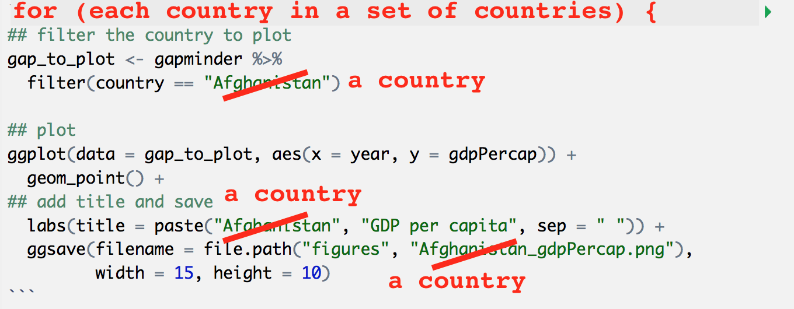

# Extended analysis {#analysis}

## Objectives and Resources

Now we are going to build a little analysis. We will learn to automate our analyses with a for loop. We will make figs, save them each with automated labeling. Then, we will join data from different files and conditionally label them with if/else statements.

Ultimately, with our analysis, we want to plot...

<!--- more here. the "analyis" is pretty underwhelming, but doing anything more may detract from all the other stuff we want to focus on--->

**Objectives**

- discuss good file naming practices
- create an R script
- for loops
- joining data
- if statements

- make sure your loop worked like you wanted
- if statements (conditionals) 
    - write message() to yourself
    - list.files()
- importing and writing data
    - write a local copy of gapminder data to data/ folder
    - installing packages from github

**Resources**


<!--- Would love to include:

When trying to see if a number or text is equal to some *single* value, use `==`. To check it against *multiple* values, use `%in%`. mine’s "%!in%" <- Negate("%in%")

list.files
file.path()
message() (with an if statement maybe)
get file extensions https://stat.ethz.ch/R-manual/R-devel/library/tools/html/fileutils.html
--->


## Naming files

Now is a good interlude to talk about naming things. 

We are going to take five minutes to talk through [Jenny Bryan's three principles for naming files](https://speakerdeck.com/jennybc/how-to-name-files):

1. machine readable
1. human readable
1. play well with default ordering

## Analysis plan

OK, here is the plan for our analysis. We want to plot the gdpPercap for each country in the gapminder data frame. We will label each one and save it in a folder called figures. We will learn a bunch of things as we go. 


## Create an R script

OK, now, we are going to create an R script. What is an R script? It's a text file with a .R extension. We've been writing R code in R Markdown files so far; R scripts are just R code without the Markdown along with it. 

Go to File > New File > R Script (or click the green plus in the top left corner). 

Let's start off with a few comments so that we know what it is for, and save it:

```
## gapminder-analysis.R
## analysis with gapminder data
## J Lowndes lowndes@nceas.uscb.edu
```

We'll be working with the gapminder data again so let's read it in here: 

```{r, message=FALSE}
## load libraries
library(tidyverse)

## read in gapminder data
gapminder <- readr::read_csv('https://raw.githubusercontent.com/OHI-Science/data-science-training/master/data/gapminder.csv')

```

Remember, like in R Markdown, hitting return does not execute this command. To execute it, we need to get what we typed in the script down into the console. Here is how we can do that:

1. copy-paste this line into the console.
2. select the line (or simply put the cursor there), and click 'Run'. This is available from 
    a. the bar above the script (green arrow)
    b. the menu bar: Code > Run Selected Line(s)
    c. keyboard shortcut: command-return
3. source the script, which means running the whole thing. This is also great for to see if there are any typos in your code that you've missed. You can do this by:
    a. clicking Source (blue arrow in the bar above the script).
    b. typing `source('gapminder-analysis.R')` in the console (or from another R file!!!). 

## Automation with for loops

Our plan is to plot gdpPercap for each country. This means that we want to do the same operation (plotting gdpPercap) on a bunch of different things (countries). Yesterday we learned the dplyr's `group_by()` function, and this is super powerful to automate through groups. But there are things that `group_by()` can't do, like plotting. So we will use a for loop.

Let's start off with what this would look like for just one country. I'm going to demonstrate with Afghanistan:

<!---TODO
For the figures, we want it to label the currency, which we have in another data file (=join). And, we'll want to add Westeros to the dataframe (=rbind) and create that figure too. 
--->

```{r}
## filter the country to plot
gap_to_plot <- gapminder %>%
  filter(country == "Afghanistan")

## plot
my_plot <- ggplot(data = gap_to_plot, aes(x = year, y = gdpPercap)) + 
  geom_point() +
  labs(title = "Afghanistan")
```

Let's actually give this a better title than just the country name. Let's use the `base::paste()` function from to paste two strings together so that the title is more descriptive. Use `?paste` to see what the "sep" variable does. 
```{r}
## filter the country to plot
gap_to_plot <- gapminder %>%
  filter(country == "Afghanistan")

## plot
my_plot <- ggplot(data = gap_to_plot, aes(x = year, y = gdpPercap)) + 
  geom_point() +
  ## add title and save
  labs(title = paste("Afghanistan", "GDP per capita", sep = " "))
```

And as a last step, let's save this figure using `base::file.path()` (which works like paste() would if sep = "/"). 
```{r}
## filter the country to plot
gap_to_plot <- gapminder %>%
  filter(country == "Afghanistan")

## plot
my_plot <- ggplot(data = gap_to_plot, aes(x = year, y = gdpPercap)) + 
  geom_point() +
## add title and save
  labs(title = paste("Afghanistan", "GDP per capita", sep = " "))

ggsave(filename = "Afghanistan_gdpPercap.png", plot = my_plot,
         width = 15, height = 10)
```

OK. So we can check in our figures/folder and see that this works well. And there wasn't that much code needed to get us here, but we definitely do not want to copy this for every country. Even if we copy-pasted and switched out the names, it would be very typo-prone. Plus, what if you wanted to instead plot lifeExp? You'd have to remember to change it each time...it gets messy quick. 

Better with a for loop. This will let us cycle through and do what we want to each thing in turn. If you want to iterate over a set of values, and perform the same operation on each, a `for` loop will do the job.

### For loop basic structure

The basic structure of a `for` loop is:
```{r, eval=FALSE}
for( each item in set of items ){
  do a thing
}
```
Note the `( )` and the `{ }`. We talk about iterating through each item in the for loop, which makes each item an iterator.

So looking back at our Afghanistan code: all of this is pretty much the "do a thing" part. And we can see that there are only a few places that are specific to Afghanistan. If we could make those places not specific to Afghanistan, we would be set. 



Let's paste from what we had before, and modify it. I'm also going to use RStudio's indentation help to indent the lines within the for loop by highlighting the code in this chunk and going to Code > Reindent Lines (shortcut: command I)
```{r, eval=FALSE}
for( each item in set of items ){
  
  ## filter the country to plot
  gap_to_plot <- gapminder %>%
    filter(country == "Afghanistan")
  
  ## plot
  my_plot <- ggplot(data = gap_to_plot, aes(x = year, y = gdpPercap)) + 
    geom_point() +
    ## add title and save
    labs(title = paste("Afghanistan", "GDP per capita", sep = " "))
    
  ggsave(filename = "Afghanistan_gdpPercap.png", plot = my_plot
           width = 15, height = 10)
} 
```

OK. So let's start with the beginning of the for loop. We want a list of countries that we will iterate through. We can do that by adding this code before the for loop. And we will need to name the iterator something, so let's call it cntry so that it has a distinct name. 

We can also add a print statement so that we can watch it iterate:
```{r, eval=FALSE}
## create a list of countries
country_list <- c("Albania", "Fiji", "Spain")

for( cntry in country_list ){
  
  ## filter the country to plot
  gap_to_plot <- gapminder %>%
    filter(country == "Afghanistan")
  
  ## add a print message 
  print(paste("Plotting", cntry))
  
  ## plot
  my_plot <- ggplot(data = gap_to_plot, aes(x = year, y = gdpPercap)) + 
    geom_point() +
    ## add title and save
    labs(title = paste("Afghanistan", "GDP per capita", sep = " "))
  
ggsave(filename = "Afghanistan_gdpPercap.png", plot = my_plot,
           width = 15, height = 10)
} 
```

At this point, we do have a functioning for loop. For each item in the `country_list$country`, the for loop will iterate over the code within the `{ }`, changing `cntry` each time as it goes through the list. And we can see it works because our print statement displays each country. 

But our code doesn't work the way we expected. Why? Well, is looping through the 3 countries in our country_list, but it is creating plots for Afghanistan each time. We can see that by looking in the git tab: only that one Afghanistan figure. It's because we haven't brought the `cntry` variable into the for loop. Let's do that now. 

### Executable for loop!

```{r, eval=FALSE}
## create a list of countries
country_list <- c("Albania", "Fiji", "Spain") 

for( cntry in country_list ){
  
  ## filter the country to plot
  gap_to_plot <- gapminder %>%
    filter(country == cntry) 
  
  ## add a print message 
  print(paste("Plotting", cntry))
  
  ## plot
  my_plot <- ggplot(data = gap_to_plot, aes(x = year, y = gdpPercap)) + 
    geom_point() +
    ## add title and save
    labs(title = paste(cntry, "GDP per capita", sep = " "))
  
ggsave(filename = paste(cntry, "_gdpPercap.png", sep = ""), plot = my_plot, 
           width = 15, height = 10)
} 
```


Great! And it doesn't matter if we just use these three countries or all the countries--let's try it. 

But first let's create a figure directory and make sure it saves there since it's going to get out of hand quickly. We could do this from the Finder/Windows Explorer, or from the "Files" pane in RStudio by clicking "New Folder" (green plus button). But we are going to do it in R. A folder is called a directory:

```{r, eval=FALSE}
dir.create("figures") 

## create a list of countries
country_list <- unique(gapminder$country) # ?unique() returns the unique values

for( cntry in country_list ){
  
  ## filter the country to plot
  gap_to_plot <- gapminder %>%
    filter(country == cntry)
  
  ## add a print message 
  print(paste("Plotting", cntry))
  
  ## plot
  my_plot <- ggplot(data = gap_to_plot, aes(x = year, y = gdpPercap)) + 
    geom_point() +
    ## add title and save
    labs(title = paste(cntry, "GDP per capita", sep = " "))
  
ggsave(filename = paste("figures/", cntry, "_gdpPercap.png", sep = ""), plot = my_plot,
           width = 15, height = 10)
} 
```

So that took a little longer than just the 3, but still super fast. For loops are sometimes just the thing you need to iterate over many things in your analyses. 

### Clean up our repo

OK we now have 142 figures that we just created. They exist locally on our computer, and we have the code to recreate them anytime. But, we don't really need to push them to GitHub. Let's delete the figures/ folder and see it disappear from the Git tab. 

### Your turn

1. Modify our for loop so that it: 
    - loops through countries in Europe only
    - plots the cumulative mean gdpPercap (Hint: Use the [Data Wrangling Cheatsheet](https://www.rstudio.com/resources/cheatsheets/)!)
    - saves them to a new subfolder inside the (recreated) figures folder called "Europe".
1. Sync to GitHub

#### Answer

No peeking!

```{r, eval=FALSE}
dir.create("figures") 
dir.create("figures/Europe") 

## create a list of countries. Calculations go here, not in the for loop
gap_europe <- gapminder %>%
  filter(continent == "Europe") %>%
  mutate(gdpPercap_cummean = dplyr::cummean(gdpPercap))

country_list <- unique(gap_europe$country) # ?unique() returns the unique values

for( cntry in country_list ){ # (cntry = country_list[1])
  
  ## filter the country to plot
  gap_to_plot <- gap_europe %>%
    filter(country == cntry)
  
  ## add a print message 
  print(paste("Plotting", cntry))
  
  ## plot
  my_plot <- ggplot(data = gap_to_plot, aes(x = year, y = gdpPercap_cummean)) + 
    geom_point() +
    ## add title and save
    labs(title = paste(cntry, "GDP per capita", sep = " "))
  
ggsave(filename = paste("figures/Europe", cntry, "_gdpPercap_cummean.png", sep = ""), 
       plot = my_plot, width = 15, height = 10)
} 
```

Notice how we put the calculation for `cummean()` outside the for loop. It could have gone inside, but it's an operation that could be done just one time before hand (outside the loop) rather than multiple times as you go (inside the for loop). 

## Joining datasets 

Let's say that our colleague just sent us another file that identifies when the data we're using was estimated versus measured (I'm making this up). Let's read in the file our colleague sent us: 

```{r, eval=FALSE}
## read in our colleague's data to join
countries_estimated <- gapminder <- readr::read_csv('https://raw.githubusercontent.com/OHI-Science/data-science-training/master/data/countries_estimated.csv')

## have a look
head(countries_estimated)
summary(countries_estimated)
str(countries_estimated)
```

(If you're interested, here is the code that I used to create this fake dataset:)

```{r fake data, eval=FALSE}
x <- countries_list %>% 
  mutate(estimated = runif(length(country), 0, 1)) %>%
  mutate(estimated = round(estimated))

x$estimated[x$estimated == 0] = "no"
x$estimated[x$estimated == 1] = "yes"
readr::write_csv(x, 'data/countries_estimated.csv')
```

So, what can we see about these data. It looks like there are 142 countries represented, just like our gapminder data. There is only one entry (row) for each country. And we want to somehow join this data with the data we have from gapminder. 

We want to do this: 


### Your turn 

With a partner, look at RStudio's Data Wrangling Cheatsheet and explore the different ways that you could join data. Which way do you think would work here?


We are going to `left_join()` the gapminder data with the estimated data. Left joining the gapminder data will keep all the information in gapminder, but with additional information from the estimated data. So gapminder doesn't lose any rows. 

Let's have a look:
```{r}
## to check:
str(gapminder) # 1704 observations of 6 variables

gapminder_est <- gapminder %>%
  left_join(countries_estimated, 
            by = "country")

str(gapminder_est) #1704 obs. of  7 variables
head(gapminder_est, 20)
```

So `left_join()`ing added a 7th column to our data, and if we have a look at it (`head()`), you can see that the yes's and no's from the estimated data have been repeated. 

Great! Now we are going to continue with our analysis. We want to label our plots  differently if they are based on estimated data. This means that when we go through our for loop, we want to conditionally plot them. 

## Conditional statements with `if` and `else` 

Often when we're coding we want to control the flow of our actions. This can be done
by setting actions to occur only if a condition or a set of conditions are met.

In R and other languages, these are called "if statements". 

### if statement basic structure

```{r, eval=FALSE}
# if
if (condition is true) {
  do something
}

# if ... else
if (condition is true) {
  do something
} else {  # that is, if the condition is false,
  do something different
}
```

Let's bring this concept into our for loop for Europe that we've just done. What if we want to add the label "Estimated" to countries that were estimated? Here's what we'd do.  

```{r, eval=FALSE}
dir.create("figures") 
dir.create("figures/Europe") 

## create a list of countries
gap_europe <- gapminder_est %>% ## use instead of gapminder
  filter(continent == "Europe") %>%
  mutate(gdpPercap_cummean = dplyr::cummean(gdpPercap))

country_list <- unique(gap_europe$country) 

for( cntry in country_list ){ # (cntry = country_list[1])
  
  ## filter the country to plot
  gap_to_plot <- gap_europe %>%
    filter(country == cntry)
  
  ## add a print message 
  print(paste("Plotting", cntry))
  
  ## plot
  my_plot <- ggplot(data = gap_to_plot, aes(x = year, y = gdpPercap_cummean)) + 
    geom_point() +
    ## add title and save
    labs(title = paste(cntry, "GDP per capita", sep = " "))
  
  ## if estimated, add that as a subtitle. 
  if (gap_to_plot$estimated == "yes") {
    
    ## add a print statement just to check
    print(paste(cntry, "data are estimated"))
    
    my_plot <- my_plot +
      labs(sutbtitle("Estimated data"))
  }
#   Warning message:
# In if (gap_to_plot$estimated == "yes") { :
#   the condition has length > 1 and only the first element will be used
  
  ggsave(filename = paste("figures/Europe", cntry, "_gdpPercap_cummean.png", sep = ""), 
       plot = my_plot, width = 15, height = 10)
    
} 
```

This worked, but we got a warning message with the if statement. This is because if we look at `gap_to_plot$estimated`, it is many "yes"s or "no"s, and the if statement works just on the first one. We know that if any are yes, all are yes, but you can imagine that this could lead to problems down the line if you *didn't* know that. So let's be explicit: 
### Executable if statement

```{r, eval=FALSE}
dir.create("figures") 
dir.create("figures/Europe") 

## create a list of countries
gap_europe <- gapminder_est %>% ## use instead of gapminder
  filter(continent == "Europe") %>%
  mutate(gdpPercap_cummean = dplyr::cummean(gdpPercap))

country_list <- unique(gap_europe$country) 

for( cntry in country_list ){ # (cntry = country_list[1])
  
  ## filter the country to plot
  gap_to_plot <- gap_europe %>%
    filter(country == cntry)
  
  ## add a print message 
  print(paste("Plotting", cntry))
  
  ## plot
  my_plot <- ggplot(data = gap_to_plot, aes(x = year, y = gdpPercap_cummean)) + 
    geom_point() +
    ## add title and save
    labs(title = paste(cntry, "GDP per capita", sep = " "))
  
  ## if estimated, add that as a subtitle. 
  if (any(gap_to_plot$estimated == "yes")) { # any() will return a single TRUE or FALSE
    
    print(paste(cntry, "data are estimated"))
    
    my_plot <- my_plot +
      labs(subtitle = "Estimated data")
  }
  ggsave(filename = paste("figures/Europe", cntry, "_gdpPercap_cummean.png", sep = ""), 
       plot = my_plot, width = 15, height = 10)
    
} 
```

OK so this is working as we expect! But an if/else statement could make us extra sure that everything is working appropriately.

### Executable if/else statement

```{r, eval=FALSE}
dir.create("figures") 
dir.create("figures/Europe") 

## create a list of countries
gap_europe <- gapminder_est %>% ## use instead of gapminder
  filter(continent == "Europe") %>%
  mutate(gdpPercap_cummean = dplyr::cummean(gdpPercap))

country_list <- unique(gap_europe$country) 

for( cntry in country_list ){ # (cntry = country_list[1])
  
  ## filter the country to plot
  gap_to_plot <- gap_europe %>%
    filter(country == cntry)
  
  ## add a print message 
  print(paste("Plotting", cntry))
  
  ## plot
  my_plot <- ggplot(data = gap_to_plot, aes(x = year, y = gdpPercap_cummean)) + 
    geom_point() +
    ## add title and save
    labs(title = paste(cntry, "GDP per capita", sep = " "))
  
  ## if estimated, add that as a subtitle. 
  if (any(gap_to_plot$estimated == "yes")) { # any() will return a single TRUE or FALSE
    
    print(paste(cntry, "data are estimated"))
    
    my_plot <- my_plot +
      labs(subtitle = "Estimated data")
  } else {
    
    print(paste(cntry, "data are reported"))
    
  }
  ggsave(filename = paste("figures/Europe", cntry, "_gdpPercap_cummean.png", sep = ""), 
       plot = my_plot, width = 15, height = 10)
    
} 
```

So now we have a working for loop with conditional if/else statements that we could build from. 


## More R!

With just a little bit of time left, here are some things that you can look into more on your own.

### Importing and Installing

Here are  some really helpful packages for you to work with: 

Remember you'll use `install.packages("package-name-in-quotes")` to install from CRAN. 

- `readr` to read in .csv files
- `readxl` to read in Excel files
- `stringr` to work with strings
- `lubridate` to work with dates

You are also able to install packages directly with Github, using the `devtools` package. Then, instead of `install.packages()`, you'll use `devtools::install_github()`. And you can create *your own* packages when you're ready. Read http://r-pkgs.had.co.nz/ to learn how!

### Organization and workflows


- set up a folder for figs, intermediate analyses, final outputs, figures

### Getting help

You'll soon have questions that are outside the scope of this workshop, how do you find answers?

- end with a ton of resources:
https://peerj.com/collections/50-practicaldatascistats/

## Ideas for Extended Analysis 2

- stringr() http://r4ds.had.co.nz/strings.html
